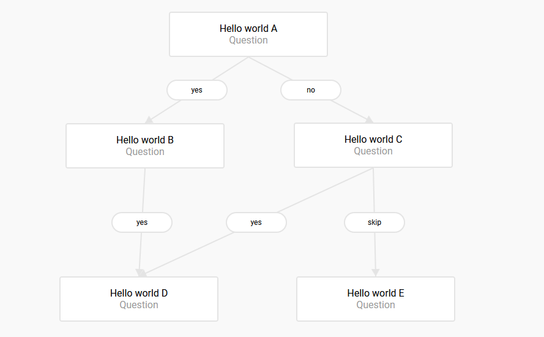

# Flowchart JavaScript Library

Open the [LIVE DEMO](https://hlhielkema.github.io/flowchart/) to try it yourself.



## Directory structure

- dist - *compiled library js and css*
- docs - *Demo website*
- node_modules - *Node.js modules installed by NPM.*
- src - *Library source files*

## 📦 Build
Bundling the flowchart code into a single Javascript and CSS file with **Webpack** requires **Node.js**. [Install Node.js](https://nodejs.org/en/) and run the command below to bundle flowchart. The files that can be used for distribution will be placed in the `/dist` directory.

```
npm run build
```

Grab the files from the `/dist` directory if you want only to use flowchart without modifying it.

**Copy library js/css to `/docs` for the demo:**
``` ps1
node updatedemo.js
```

## ✔️ Linting


This project uses ESLint to ensure a consistent coding style. The rules are a minor extension on the Airbnb rules. Use this command to run ESLint:

```
npm run lint
```

> Use `eslint --fix ./src/` for automated fixing (where possible).
